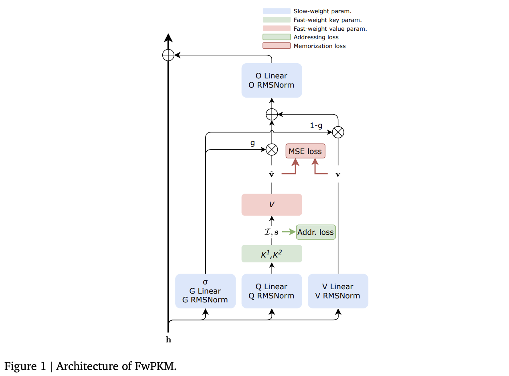

</img>

## Fast Weight Product Key Memory

Implementation of the [Fast Weight Product Key Memory](https://arxiv.org/abs/2601.00671) proposed by Sakana AI

## Install

```bash
$ pip install fast-weight-product-key-memory
```

## Usage

```python
import torch
from fast_weight_product_key_memory import fwPKM

mem = fwPKM(
    dim = 512,
    num_memories = 256 * 256,
    dim_queries_keys = 512,
    dim_values = 512,
    topk = 8,
    learning_rate = 1.,
    chunk_size = 256
)

tokens = torch.randn(2, 256, 512)

# forward a chunk of tokens for retrieved and the fast weight episodic memories

retrieved, next_memories = mem(tokens, return_next_memories = True)

# chain memories

retrieved, next_memories = mem(tokens, return_next_memories = True, past_memories = next_memories)
retrieved, next_memories = mem(tokens, return_next_memories = True, past_memories = next_memories)
retrieved, next_memories = mem(tokens, return_next_memories = True, past_memories = next_memories)
```

## Enwik8

Character-level language model with `fwPKM`

```shell
$ uv run train_enwik8.py
```

## Appreciation

- [Pranoy](https://codeberg.org/pranoyr) for the contribution of multi-head fwPKM!

## Citations

```bibtex
@misc{zhao2026fastweightproductkeymemory,
    title   = {Fast-weight Product Key Memory}, 
    author  = {Tianyu Zhao and Llion Jones},
    year    = {2026},
    eprint  = {2601.00671},
    archivePrefix = {arXiv},
    primaryClass = {cs.CL},
    url     = {https://arxiv.org/abs/2601.00671}, 
}
```
